# Execute CloudFormation Script 
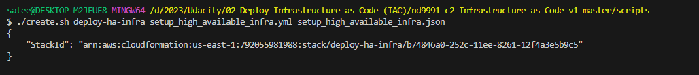

# Stack Execution in-process
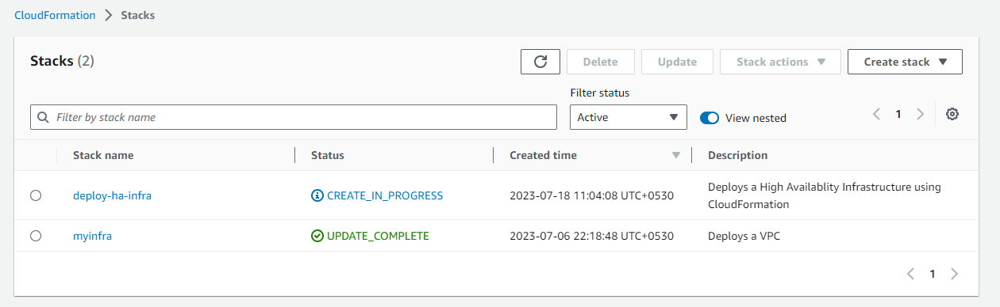

# Stack Execution complete
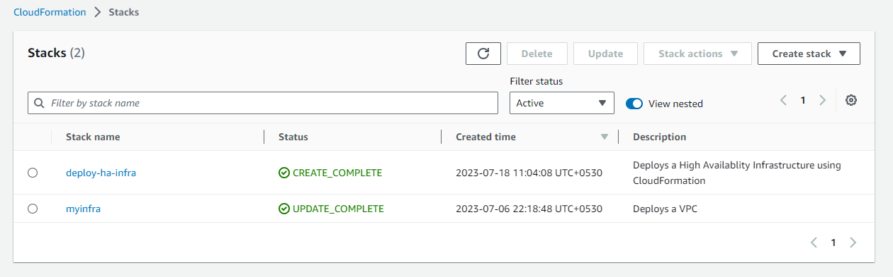

# Stack Details
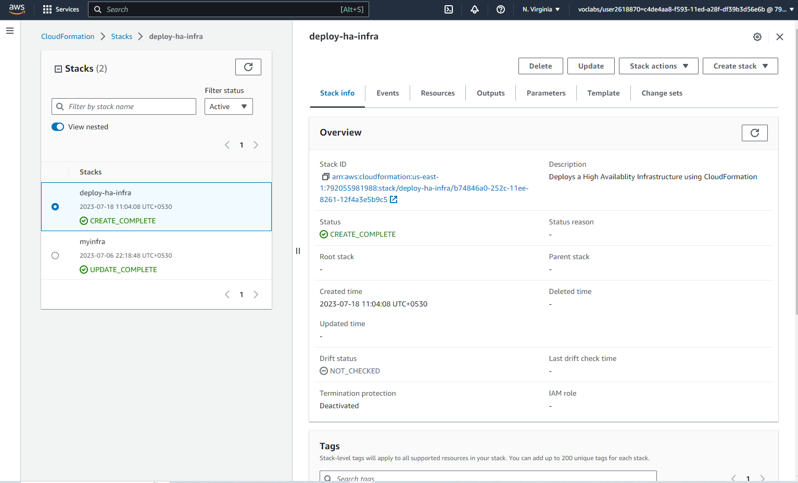

# Stack Events
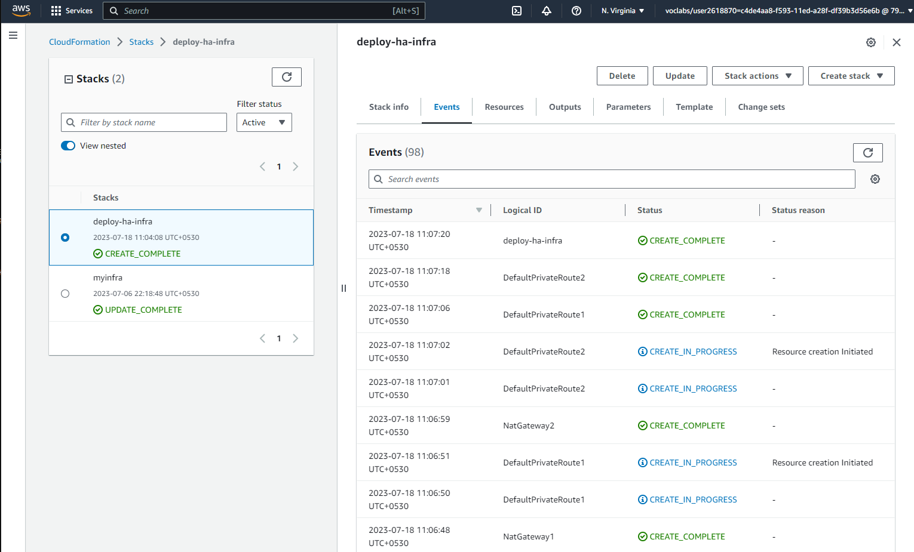

# Stack Resources
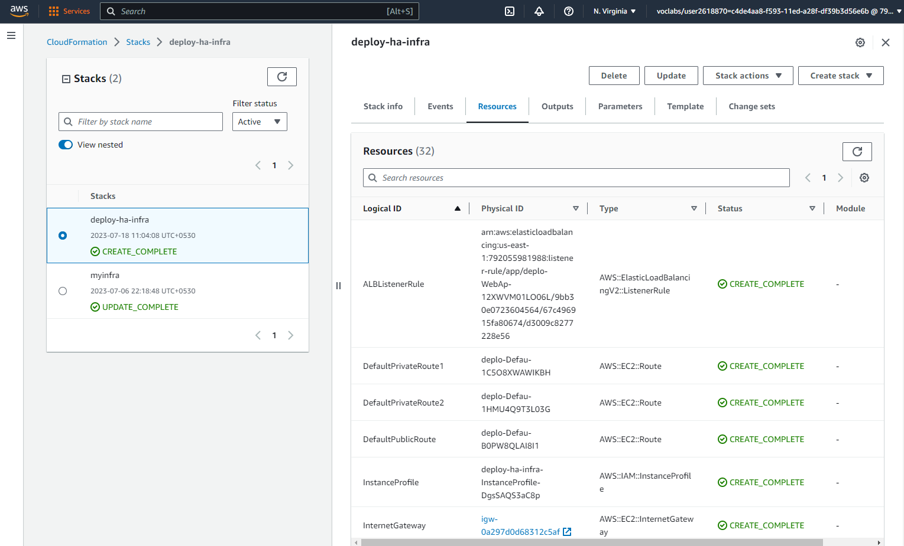

# Stack Outputs
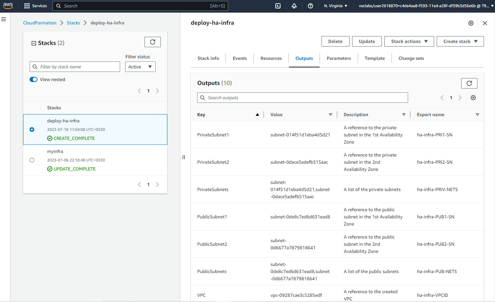

# Stack Parameters
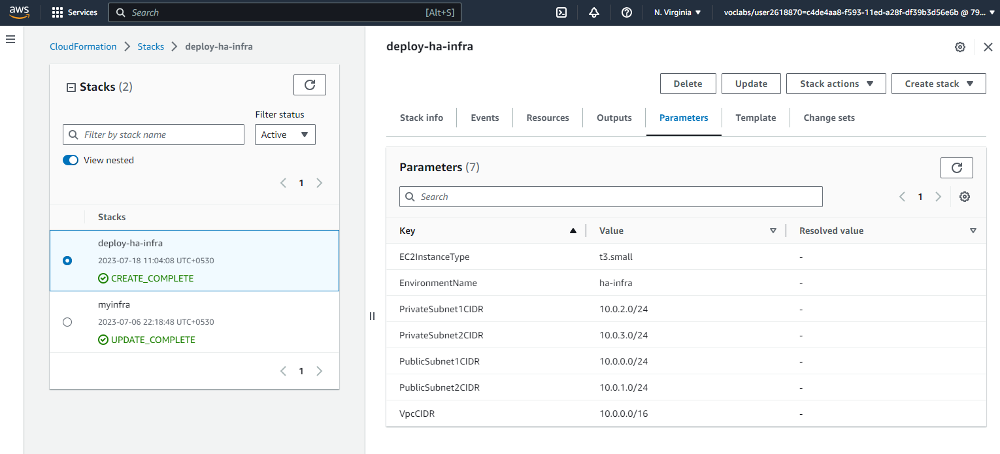

# Stack Template
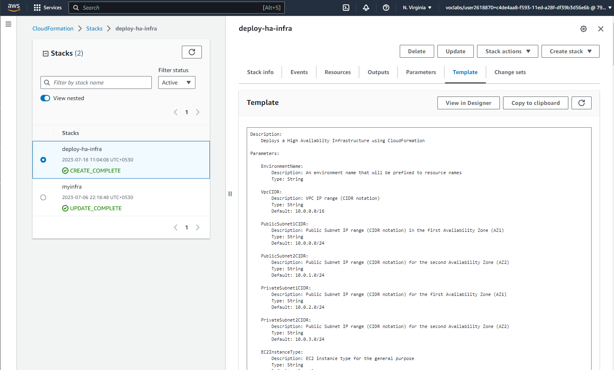

# Delete Stack 
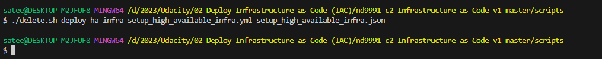

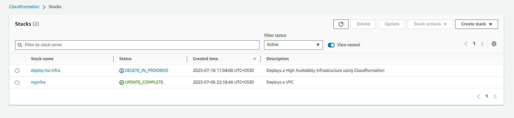

