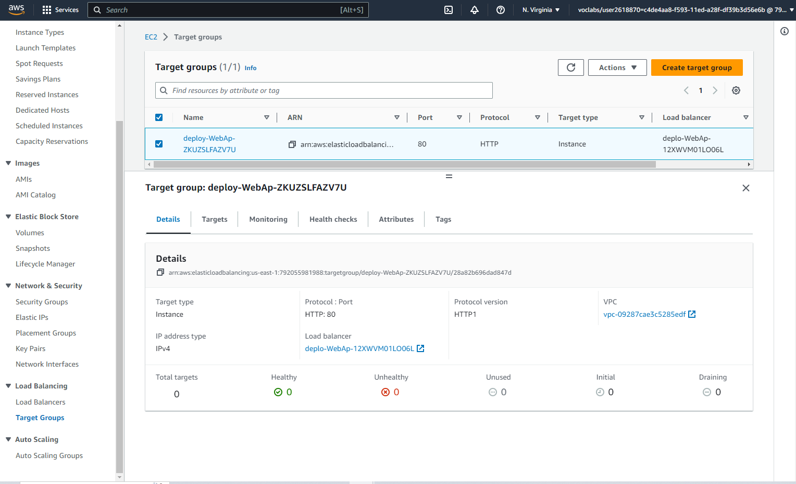

# Resources

## VPC

## Subnets

## Internet Gateway

## Route Tables

## EC2

## Security Groups

## IAM Role, Policy, Instance Profile

## Auto Scaling Group

## Load Balancer

## Load Balancer Launch Configurations

## Load Balancer 

## Load Balancer Rules

## Load Balancer Network Mapping

## Load Balancer Target Group

